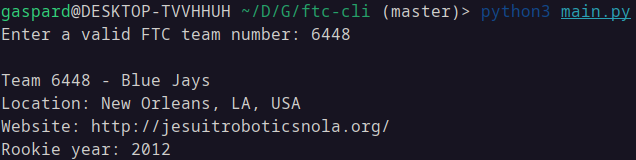

# ftc-cli
Retrieve information about FTC teams from the command line.

## How it works
It uses the First Tech Challenge API to pull information about a desired team. You need to sign up for an API key to use this program.

## Setup
1. Sign up for a First Tech Challenge API key using [this link](https://ftc-events.firstinspires.org/services/API).
2. In the `main.py` file, go to line 5 (`credentials`), and add your credentials in lieu of the brackets. <br> NOTE: You must delete the brackets and everything inside of them. Add your credentials inside the single quotation marks. <br> FORMAT: `username:[API Key]`
3. Run the `main.py` file.
4. When prompted, enter any valid FTC team number.

### Sample Output
```
Enter a valid FTC team number: 6448

Team 6448 - Blue Jays
Location: New Orleans, LA, USA
Website: http://jesuitroboticsnola.org/
Rookie year: 2012
```
## Known bugs
- [ ] Entering any out-of-range or invalid team numbers pulls information for FTC 0001 Team Unlimited
